# Ticket-Reservation-System

Authors:

- Garnet Crookes 
- David Cheng
- Olusola Akinbode
- Usman Zia 

## Summary

Created a movie theater ticket reservation system using React and Spring-Boot. 

System allows a guest user to select a movie to purchase tickets for it. Or a registered user to login and purchase tickets. Either user can cancel a ticket, but guest users are charged an additional fee.

Front-end was implemented using react to create all components. Backend was implemented using Spring Boot and a MySQL database with a JPA connection. A REST API was used for communication between the frontend and backend

## Example Functionallity

### Login/Register

1. Press the Login button on the top right of the screen 
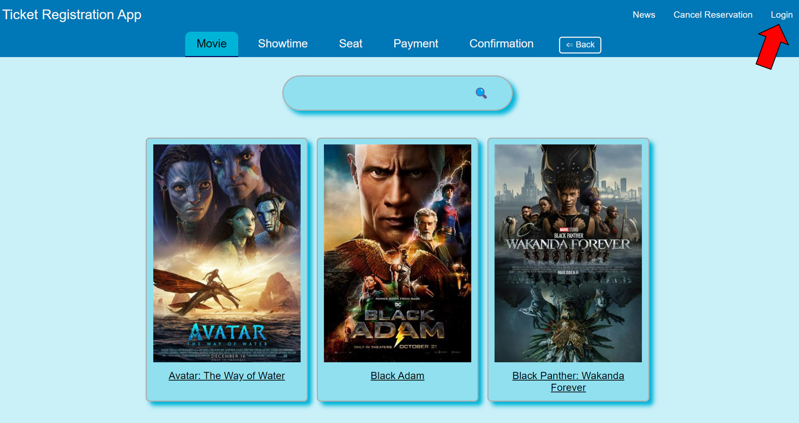

1. Either enter existing login information and Sign In or press Register for an Account
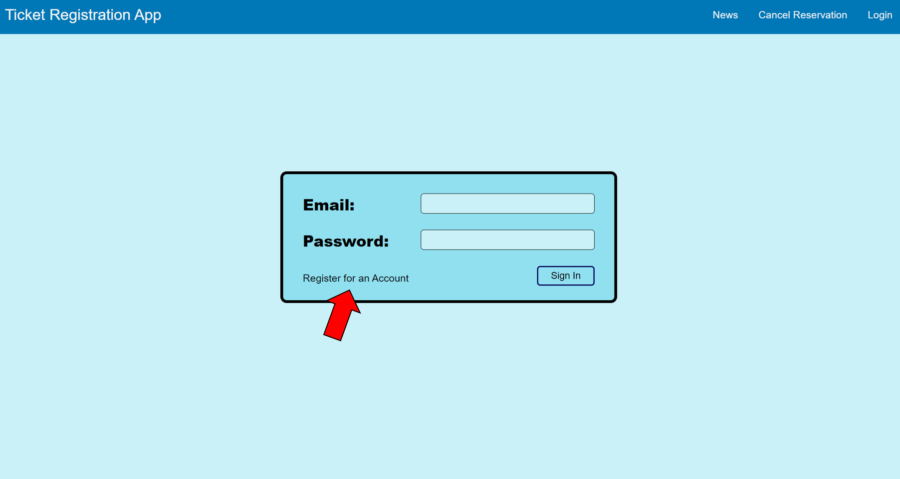

1. Enter the required user information and credit card information to make purchases quicker. Then press the Register Button
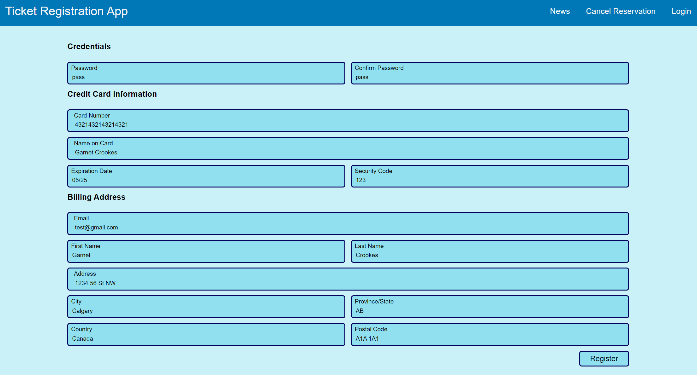


### Purchase a Ticket

1. On the main page select a movie to purchase a ticket for. If logged in as registered user additional movies will be shown before their public release. After selecting a movie you will be taken to the showtime tab
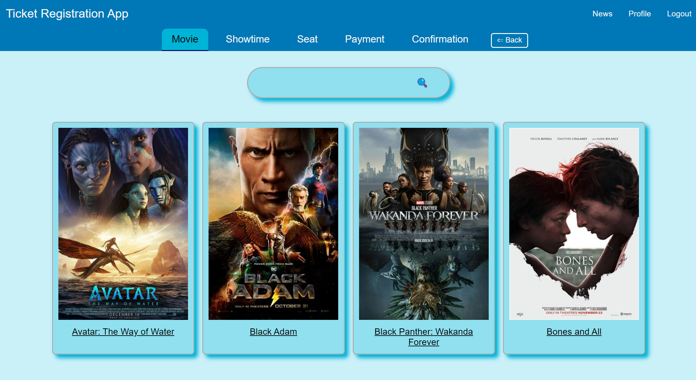

1. The various theaters are shown as an accordian list. Within the list different days are shown as a separate list. Open the correct theater and date and then select a showtime to purchase a ticket for
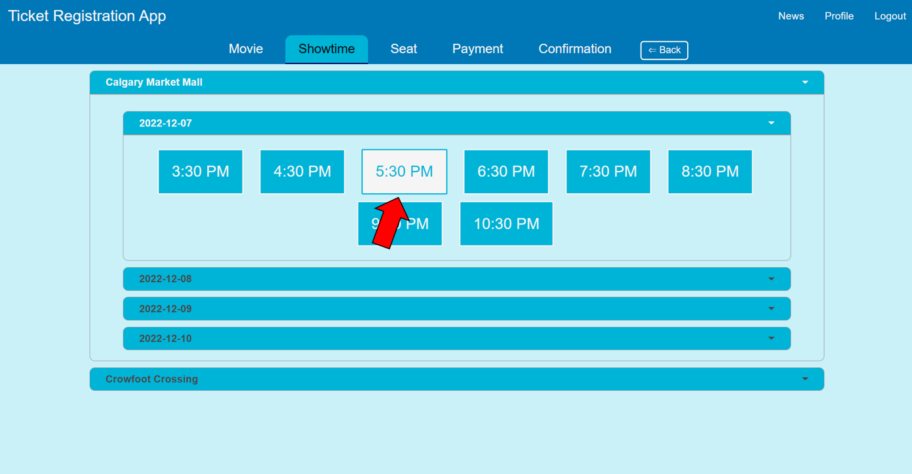

1. Select one or more of the available seats by clicking on it, seats can be removed by clicking on them again. When all selections have been made press the Confirm Selection button
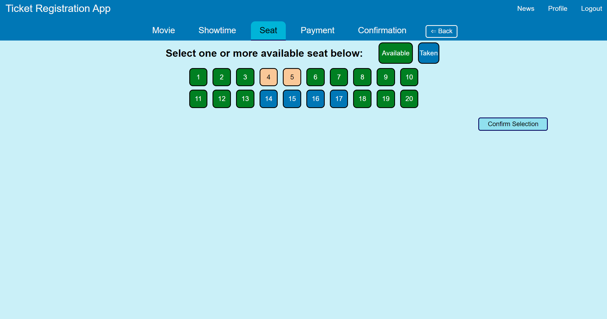

1. If logged in then credit card information will be loaded otherwise enter information and press purchase. Note credit card will not be charged but confirmation email will be sent
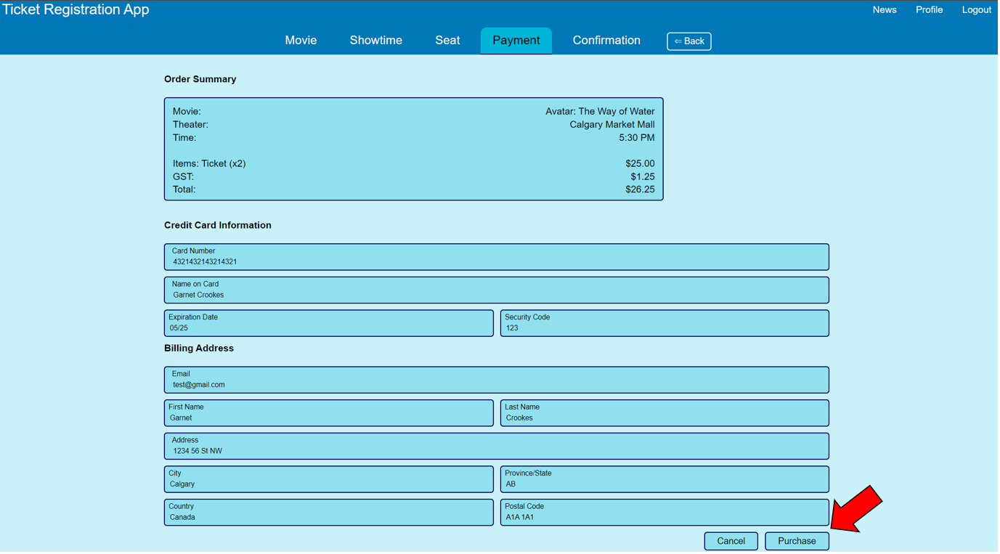

1. The confirmation screen will be shown which shows the purchased tickets and payment information 
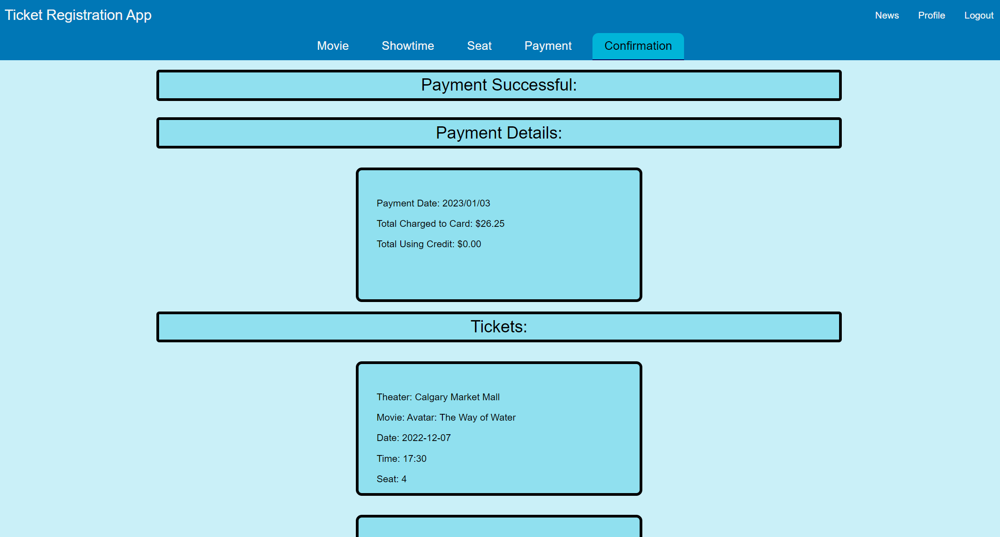

### Cancel Tickets
1. Pressing on the profile button on the navbar will bring up the user profile. From this page you can cancel tickets that are in the future. A credit will then be added to the account. For registered users a full credit will be recieved otherwise a 15% admin fee will be charged
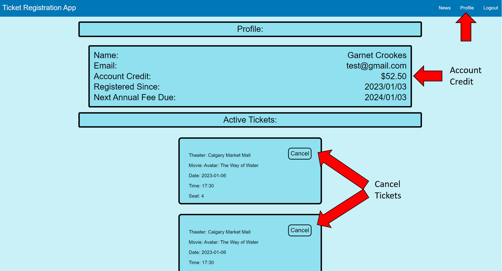

## How to Run Program

You need to have the backend server running before starting 

### 1. Clone the Project

Using Git Bash run the following commands:

```
git clone https://github.com/ChengDave/ticket-reservation-system.git

cd ticket-reservation-system
``` 

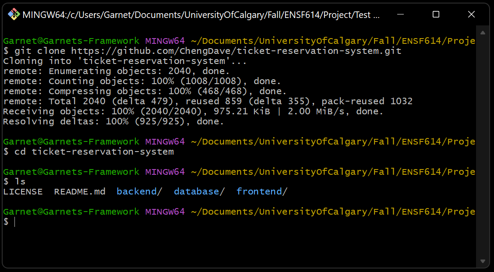

### 2. Start the Backend

Using Git Bash or another terminal run the following commands:

```
cd backend/Movie-Theater-Ticket-App
mvn clean install
mvn spring-boot:run
``` 

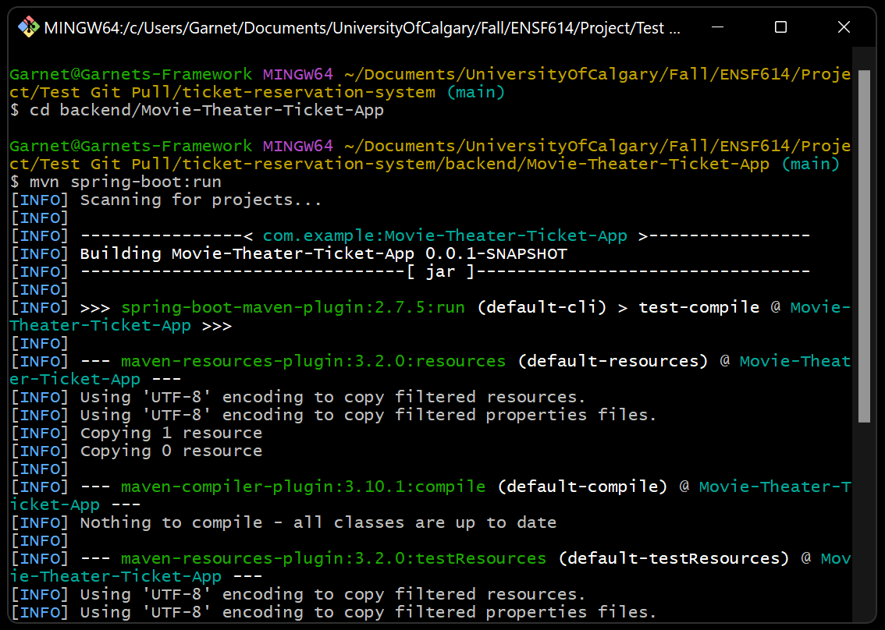

### 3. Start the Frontend

Require NPM to be installed on the machine to start the react app. 

Open a separate terminal then the on the backend is running on and enter the following commands

```
cd frontend/ticket-frontend
npm start
```

This will launch the website in a web browser at http://localhost:3000/

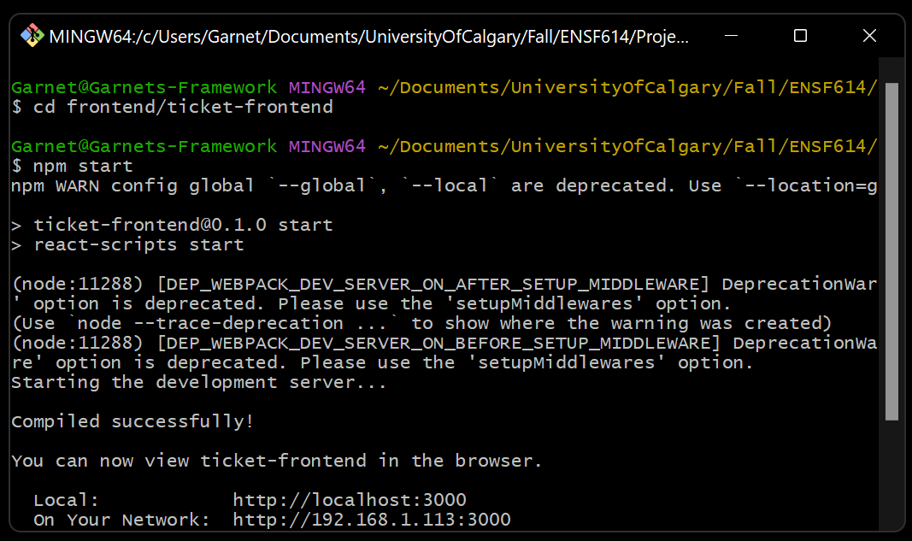
